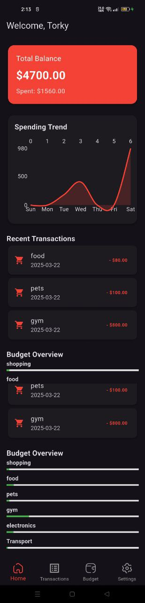
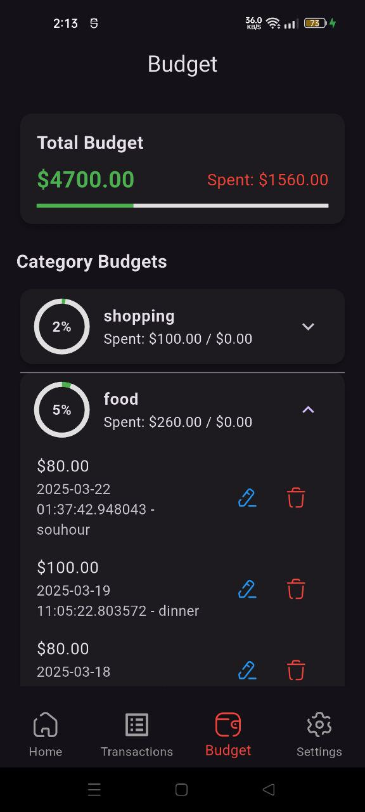
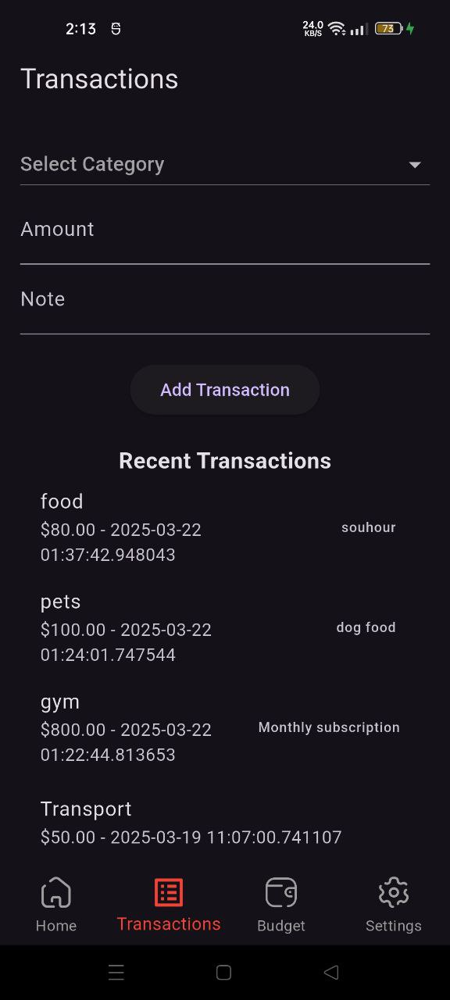
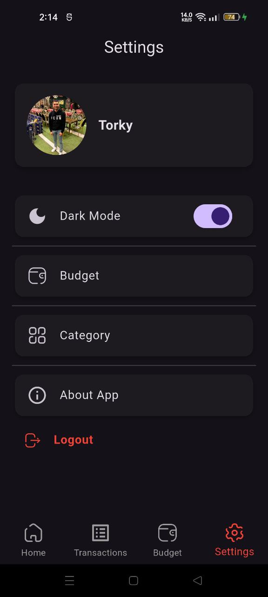
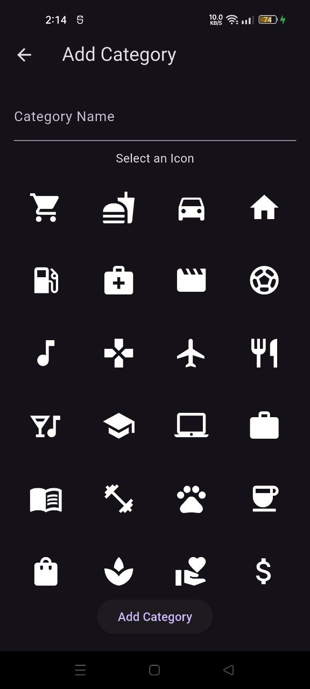
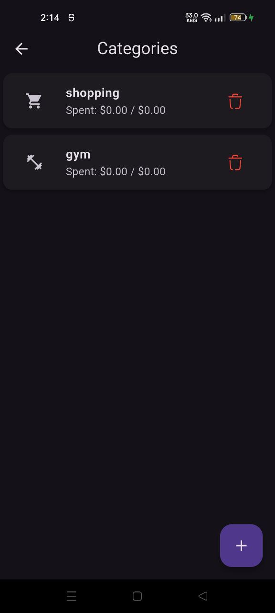
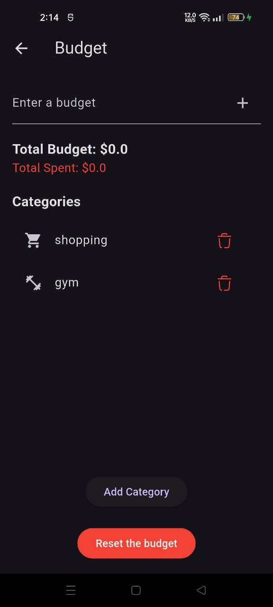

# 📊 Personal Finance & Budgeting App  

A **Flutter-based** personal finance and budgeting app to track expenses, set budgets, and analyze spending trends.  

---

## 📸 Screenshots  

| Home Screen | Budget Overview | Transactions | Profile |
|-------------|---------------|-------------|
|  |  |  |  |

| Add Category | Categories | Edit Budget |
|-------------|---------------|-------------|
|  |  |  |
---

## ✨ Features  
✔️ **Track Income & Expenses** – Log transactions easily.  
✔️ **Budget Categories** – Organize expenses into categories.  
✔️ **Transaction History** – View and manage past transactions.  
✔️ **Spending Trends** – Graphs & insights into your spending.  
✔️ **Multi-language Support** – Supports **English & Arabic**.  
✔️ **Dark & Light Mode** – Customizable theme settings.  

---

## 🛠️ Tech Stack  
- **Flutter** (State Management: **Cubit**)  
- **Dart**  
- **Hive** (Local Storage)  
- **fl_chart** (Graphs & Charts)  
- **SharedPreferences** (Local App Settings)  

---

## 🚀 Installation  

1️⃣ **Clone the repository:**  
```bash
git clone https://github.com/MoShehata7920/Personal-Finance---Budgeting-App.git

2️⃣ ** Navigate to the project directory:**  
```bash
cd your-repo

3️⃣ ** Install dependencies:**  
```bash
flutter pub get

4️⃣ ** Run the app:**  
```bash
flutter run
---

## 📌 Usage
-1️⃣ Set your initial budget 📊
-2️⃣ Add transactions 💸
-3️⃣ Monitor & analyze your expenses 📉
---

## 🤝 Contributing
- Contributions are welcome! If you’d like to improve this project, feel free to open issues or submit pull requests.
---

## 📜 License 
- This project is licensed under the MIT License.
---